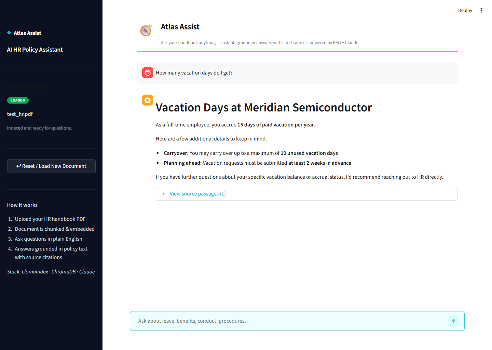
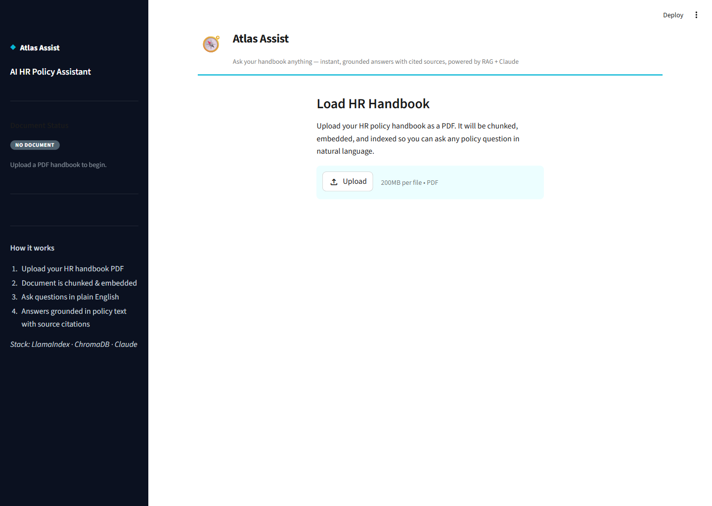

# Wren

**Ask your handbook anything.** Grounded answers, cited sources, no waiting on HR.

Wren is a Retrieval-Augmented Generation (RAG) chatbot: it reads an HR policy handbook PDF and lets employees ask plain-English questions about leave, benefits, conduct, or procedures — getting answers pulled from, and cited to, the actual document, not a language model's general knowledge.

**[Live demo →](#deployment)** &nbsp;·&nbsp; Built with LlamaIndex, ChromaDB, and Claude. Preloaded with a sample handbook — try it with zero setup.



## The problem

Company handbooks are long, dense, and rarely read end-to-end. When an employee has a benefits or leave question, they either dig through a 60-page PDF, ping HR and wait, or guess. A keyword search over the PDF doesn't help much either — real questions ("how much notice do I need to give for parental leave?") rarely match the document's exact wording. Wren fixes this with semantic search plus an LLM that answers *only* from what's actually in the document, and shows its work.

## Use case

The app comes preloaded with a sample employee handbook, so anyone opening the deployed demo lands directly in a working chat — no upload required. Wren also generates a set of realistic FAQ starter questions grounded in that specific document, and answers any follow-up conversationally, always citing the exact passages and page numbers it used, so the answer is auditable, not just plausible-sounding. Anyone can also reset and upload their own handbook to try it against a different document.



## How it works

```
PDF (preloaded, or uploaded by the user)
    │
    ▼
LlamaIndex SimpleDirectoryReader   — parses PDF into text nodes
    │
    ▼
FastEmbed (BAAI/bge-small-en-v1.5) — dense vector embeddings per chunk
    │
    ▼
ChromaDB (in-memory)               — vector store for the session
    │
    ▼
User asks a question
    │
    ▼
Top-3 relevant chunks retrieved by cosine similarity
    │
    ▼
Chunks + question → Claude          — generates a grounded answer
    │
    ▼
Answer + source passages shown in the UI
```

| Layer | Technology |
|---|---|
| LLM | Anthropic Claude, via the Anthropic API |
| RAG orchestration | LlamaIndex |
| Vector store | ChromaDB (ephemeral, per-session) |
| Embeddings | HuggingFace `BAAI/bge-small-en-v1.5` |
| Frontend | Streamlit |
| PDF parsing | `pypdf` via `llama-index-readers-file` |

The sample handbook's index is built once per running server (`st.cache_resource`), so after the first visitor pays the one-time embedding cost, every subsequent visitor gets an instant, ready-to-use chat.

## Running locally

```bash
python -m venv .venv
# macOS/Linux: source .venv/bin/activate
# Windows:     .venv\Scripts\activate

pip install -r requirements.txt
cp .env.example .env   # then add your ANTHROPIC_API_KEY

streamlit run app.py --server.port 8502   # or omit the flag to use Streamlit's default port
```

Open the URL Streamlit prints (defaults to `http://localhost:8501` if you don't pass `--server.port`) — the sample handbook loads automatically. Use the sidebar's **Reset / Load New Document** to try your own PDF instead. Get an API key at [console.anthropic.com](https://console.anthropic.com/).

## Deployment

This is a Python/Streamlit app, so it can't be hosted on GitHub Pages (static files only). It deploys for free on **[Streamlit Community Cloud](https://share.streamlit.io)**:

1. Push this repo to GitHub.
2. Go to [share.streamlit.io](https://share.streamlit.io) → **New app** → select this repo, branch `main`, file `app.py`.
3. Under **Settings → Secrets**, add `ANTHROPIC_API_KEY = "sk-ant-..."`.
4. Deploy — you'll get a public `*.streamlit.app` URL, preloaded and ready for any visitor.

## Project structure

```
gf-hr-bot/
├── app.py                      # Streamlit UI — preload, chat, source display
├── ingest.py                   # PDF loading, chunking, embedding, ChromaDB indexing
├── retrieval.py                # RAG query engine + Claude answer generation
├── assets/                     # Screenshots used in this README
├── data/
│   └── sample_handbook.pdf     # Bundled demo document (uploads aren't committed)
├── requirements.txt
├── .env.example
└── .streamlit/config.toml      # Theme + server config
```

## Disclaimer

This is a portfolio project. It is document-agnostic — it works with any HR policy PDF you upload. No real employer's confidential information, branding, or trademarks are used; the sample document and any company names referenced in demo answers are fictional.

## License

MIT — see [LICENSE](LICENSE).
